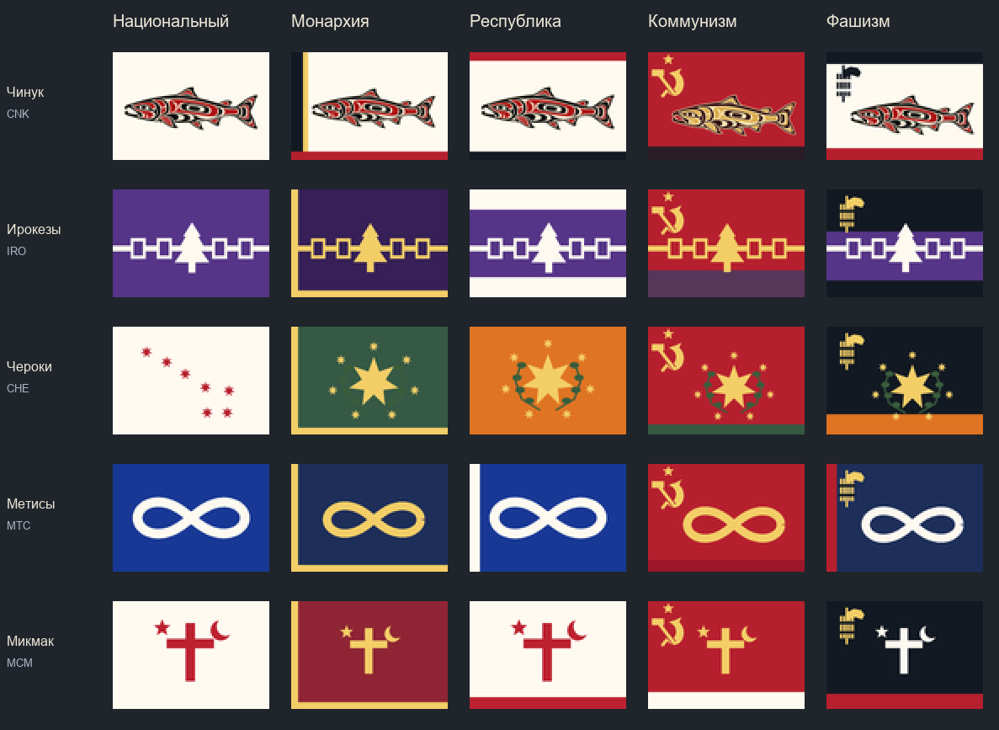

# Ultimate Ultimatum: Знамёна идей

«Знамёна идей» — русское дополнение к **Ultimate Ultimatum 0.8** для **Victoria II: Heart of Darkness**. Основной упор здесь на перевод, партии и идеологии. Отдельно доработана игра за коренные народы Америки: у них есть свои события и возможность заселять соседние земли.

Публичная версия придерживается исторических дат: партии появляются в свою эпоху, а доступные политические направления меняются по ходу кампании.

**Текущая версия: 0.1.0-alpha.6.**

[Скачать мод](https://github.com/Darmen-maker2023/Victoria-II-ultimate-ultimatum---RUS-/releases/download/v0.1.0-alpha.6/Ultimate-Ultimatum-Znamena-idey-v0.1.0-alpha.6.zip) · [Что изменилось](CHANGELOG.md) · [Известные проблемы](AUDIT.md)

В **alpha.6** расширен выбор партий: минимум по два консервативных, реакционных и либеральных варианта после открытия идеологии. Отдельно проверены 87 держав, объединений и индейских стран. У Чинуков 48 партий с разными названиями и программами. Для этого обновления нужна новая публичная кампания. [Что добавлено и как проверялось](docs/party-variety.md).

## Что есть в дополнении

### Партии и идеологии

В моде **16 идеологий** и **15 877 партийных записей для 539 стран**. В это число входят партии разных государств и периодов; доступный набор зависит от страны и даты начала игры.

Партии новых идеологий появляются в предусмотренные исторические периоды.

Консерватизм, реакционизм, либерализм, национализм, милитаризм, аграризм, социализм, анархо-либерализм, коммунизм, корпоратизм, синдикализм, фашизм, технократизм, исламизм, экологизм и киберавтономизм — от политики раннего Нового времени до направлений, появляющихся в поздних сценариях.

Даты появления идеологий

| Идеология | Год |
|---|---:|
| Консерватизм и реакционизм | 1600 |
| Либерализм | 1776 |
| Милитаризм | 1815 |
| Национализм | 1820 |
| Анархо-либерализм | 1848 |
| Аграризм и социализм | 1860 |
| Коммунизм | 1870 |
| Корпоратизм | 1880 |
| Синдикализм | 1890 |
| Фашизм | 1905 |
| Технократизм | 1930 |
| Исламизм | 1950 |
| Экологизм | 1960 |
| Киберавтономизм | 2000 |

В отдельных странах открытие политических направлений также зависит от событий и игровых условий.

### Игра за индейцев

У **23 государств коренных народов Америки**, в том числе Чинуков, ирокезов, ацтеков и инков, есть дополнительные возможности для развития.

Решение **«Заселить соседние земли»** позволяет занять одну свободную провинцию на своей границе в Северной или Южной Америке. Для него не нужны технологии обычной колонизации или статус великой державы.

Условия простые: мирное время, подходящая соседняя земля и **250 денег** в казне. Решение доступно с **1604 по 1749 год**, после заселения придётся подождать **пять лет**. Так у индейских государств появляется свой способ расширяться в Америке.

В верхней палате показываются доли идеологий. Полный список доступных партий находится в окне выбора правящей партии; несколько партий одной идеологии не создают отдельные сектора верхней палаты.

Также добавлены **три разовых события**. В них можно выбрать поддержку своего политического курса, получить деньги на развитие или снизить недовольство населения.

У 22 индейских стран обновлены флаги для разных режимов. В оформлении использованы культурные мотивы народов, а коммунистические и фашистские варианты получили читаемую политическую символику. [Источники и пояснения к флагам](docs/native-flags-sources.json).

### Русский перевод

Переведены интерфейс, события, решения, названия партий и идеологий. Исправлен формат таблиц перевода и шаблонов названий армий. В alpha.5 добавлены русские тексты 49 событий холодной войны и исправлены отсутствующие названия решений. Проверка ссылок на заголовки, описания и варианты ответа событий прошла. Редактура перевода основы продолжается.

### Сценарии и основа

Доступны **14 стартовых дат**: 1604, 1714, 1764, 1800, 1836, 1861, 1870, 1914, 1923, 1939, 1946, 1964, 2000 и 2023 год.

От Ultimate Ultimatum сохранены его страны, карта, культуры, флаги, события и решения. В основе есть японский сёгунат, наполеоновские события, мировые войны, холодная война и международные организации. Некоторые цепочки событий основы ещё нуждаются в исправлении.

## Установка

Нужна установленная **Victoria II: Heart of Darkness**. В архиве уже есть копия Ultimate Ultimatum с дополнением.

1. [Скачайте архив alpha.6](https://github.com/Darmen-maker2023/Victoria-II-ultimate-ultimatum---RUS-/releases/download/v0.1.0-alpha.6/Ultimate-Ultimatum-Znamena-idey-v0.1.0-alpha.6.zip) и распакуйте его.
2. Откройте папку, где установлена Victoria II и лежит `v2game.exe`.
3. Скопируйте туда папку `mod` из архива. Согласитесь на объединение папок.
4. В лаунчере выберите **Ultimate Ultimatum: Знамёна идей v0.1.0-alpha.6**. Исходный Ultimate Ultimatum и другие подмоды одновременно включать не нужно.
5. Начните новую кампанию. В alpha.6 изменяется числовая нумерация партий: старый сейв без отдельного переноса ссылок использовать нельзя.

Сохранения дополнения лежат в отдельной папке пользовательских данных. Архив содержит только мод и его документацию.

### Если обновляете старую версию

Начиная с alpha.4 папка и файл мода называются: `mod/Ultimate Ultimatum - Znamena idey` и `Ultimate Ultimatum - Znamena idey.mod`.

Сначала уберите старую папку `mod/Ultimate Ultimatum - Epokha idey` и одноимённый файл `.mod` из каталога игры, затем скопируйте новую папку `mod` из архива. Старую папку можно перенести в отдельное место как резервную копию. При последующих обновлениях заменяйте папку `Ultimate Ultimatum - Znamena idey` целиком, чтобы в ней не оставались устаревшие файлы.

Каталог пользовательских данных намеренно сохранён прежним: `Ultimate Ultimatum - Epokha idey Historical`. Переименование мода не переносит и не удаляет ваши сохранения.

Само обновление мода не исправляет сохранение, если оно уже повреждено.

## Состояние мода

Это пока **альфа-версия**. В alpha.6 расширен выбор партий и исправлена ошибка в файле Неаполя. Проверка файлов не выявила распознаваемых ошибок. Игра при подготовке релиза не запускалась; длительная кампания и работа сохранений ещё требуют проверки в движке.

В основе остаются неполные цепочки событий и отсутствующие данные некоторых сценариев. Подробнее — в [списке известных проблем](AUDIT.md).

Если нашли ошибку, [создайте issue](https://github.com/Darmen-maker2023/Victoria-II-ultimate-ultimatum---RUS-/issues). Укажите версию мода, страну, игровую дату и действие, после которого возникла проблема. Скриншот или журнал ошибки помогут разобраться.

## Авторы и источники

Дополнение основано на работе авторов Ultimate Ultimatum и использованных в нём модов. Ссылки и сведения о правах собраны в [NOTICE.md](NOTICE.md).
